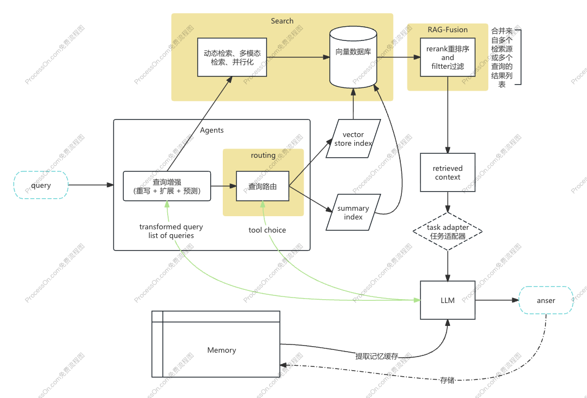

# 解决的问题

- 知识的局限性。大模型自身的知识完全源于训练数据，主流大模型对一些实时性的、非公开的数据是没有的。
- 幻觉问题。在大模型不具备的知识或者不擅长的任务场景时会胡编乱造。
- 数据安全性。


# 系统架构图


## 查询增强

使用langchain的LCEL表达式，将多个增强任务构造为RunnableSerializable，使用RunnableParallel并行化执行增强任务，可以显著减少消耗时间。

test model: deepseek-v3.1

同步请求时，平均一个请求耗时 4s 。

```text
2026-01-08 16:33:27.107 | INFO     | src.monitoring.logger:monitor_task_status:25 - [query_enhancer.py] query enhancer starting...: "None"
2026-01-08 16:33:39.162 | INFO     | src.monitoring.logger:monitor_task_status:25 - [logger.py] __main__.test_serialization: "12.0545"
2026-01-08 16:33:39.162 | INFO     | src.monitoring.logger:monitor_task_status:25 - [query_enhancer.py] enhancer 【expand】 chain response: "{'result': '比较迪士尼动画电影《疯狂动物城》中的角色兔子警官朱迪·霍普斯（Judy Hopps）与现实生活中被誉为‘最美护士’的医疗工作者在人物形象、职业特性、社会意义以及文化象征方面的异同点', 'reason': '原始查询存在歧义性：‘最美护士’可能指代现实中的模范医护工作者（如疫情期间受表彰者）或特定影视角色。扩展后明确比较维度（形象/职业/社会意义），并区分虚构角色与现实人物，同时保留‘最美护士’的宽泛性以涵盖多种可能性，从而提高信息检索的精准度'}"
2026-01-08 16:33:39.163 | INFO     | src.monitoring.logger:monitor_task_status:25 - [query_enhancer.py] enhancer 【decomposition】 chain response: "['查询兔子警官的相关信息', '查询最美护士的相关信息', '对比分析兔子警官和最美护士的相似之处', '对比分析兔子警官和最美护士的不同之处']"
2026-01-08 16:33:39.163 | INFO     | src.monitoring.logger:monitor_task_status:25 - [query_enhancer.py] enhancer 【predict】 chain response: "兔子警官（朱迪·霍普斯）和最美护士（通常指现实中的医护工作者或特定角色）的对比：  \n- **职业领域**：兔子警官属于动画虚构的执法职业（《疯狂动物城》），代表正义与勇气；最美护士属于现实中的医疗行业，象征奉献与关爱。  \n- **形象特点**：朱迪警官乐观坚韧，突破偏见；护士通常以专业、耐心、救死扶伤的形象被赞誉。  \n- **社会意义**：两者均为正能量符号，但兔子警官侧重梦想与平等，护士突出现实中的职业精神与人文关怀。  \n\n（注：若“最美护士”指特定角色或事件，需具体分析。）"
2026-01-08 16:33:39.240 | INFO     | src.monitoring.logger:monitor_task_status:25 - [query_enhancer.py] Enhanced queries result: [{'query': '对比兔子警官和最美护士', 'start_time': None, 'end_time': None}, {'query': '比较迪士尼动画电影《疯狂动物城》中的角色兔子警官朱迪·霍普斯（Judy Hopps）与现实生活中被誉为‘最美护士’的医疗工作者在人物形象、职业特性、社会意义以及文化象征方面的异同点', 'start_time': None, 'end_time': None}, {'query': '查询兔子警官的相关信息', 'start_time': None, 'end_time': None}, {'query': '查询最美护士的相关信息', 'start_time': None, 'end_time': None}, {'query': '对比分析兔子警官和最美护士的相似之处', 'start_time': None, 'end_time': None}, {'query': '对比分析兔子警官和最美护士的不同之处', 'start_time': None, 'end_time': None}, {'query': '兔子警官（朱迪·霍普斯）和最美护士（通常指现实中的医护工作者或特定角色）的对比：  \n- **职业领域**：兔子警官属于动画虚构的执法职业（《疯狂动物城》），代表正义与勇气；最美护士属于现实中的医疗行业，象征奉献与关爱。  \n- **形象特点**：朱迪警官乐观坚韧，突破偏见；护士通常以专业、耐心、救死扶伤的形象被赞誉。  \n- **社会意义**：两者均为正能量符号，但兔子警官侧重梦想与平等，护士突出现实中的职业精神与人文关怀。  \n\n（注：若“最美护士”指特定角色或事件，需具体分析。）', 'start_time': None, 'end_time': None}]: "None"
2026-01-08 16:33:39.240 | INFO     | src.monitoring.logger:monitor_task_status:25 - [query_enhancer.py] query enhancer ended...: "None"
```

并行化后，平均一个请求耗时 1 ~ 1.5s

```text
2026-01-08 16:49:12.884 | INFO     | src.monitoring.logger:monitor_task_status:25 - [query_enhancer.py] query enhancer starting...: "None"
2026-01-08 16:49:12.885 | INFO     | src.monitoring.logger:monitor_task_status:25 - [query_enhancer.py] query chain task starting...: "None"
2026-01-08 16:49:15.684 | INFO     | src.monitoring.logger:monitor_task_status:25 - [query_enhancer.py] query chain task ended...: "None"
2026-01-08 16:49:15.685 | INFO     | src.monitoring.logger:monitor_task_status:25 - [query_enhancer.py] enhancer 【expand】 chain response: "对比动画电影《疯狂动物城》中的兔子警官朱迪·霍普斯（Judy Hopps）与现实生活中被媒体称为\"最美护士\"的人物（如疫情期间受到广泛报道的医护人员）在角色定位、社会贡献、公众形象及文化象征意义方面的异同点。"
2026-01-08 16:49:15.685 | INFO     | src.monitoring.logger:monitor_task_status:25 - [query_enhancer.py] enhancer 【decomposition】 chain response: "['查询兔子警官的相关信息', '查询最美护士的相关信息', '对比兔子警官和最美护士的特征或属性']"
2026-01-08 16:49:15.685 | INFO     | src.monitoring.logger:monitor_task_status:25 - [query_enhancer.py] enhancer 【predict】 chain response: "兔子警官和最美护士都是积极正面的角色形象，但定位不同：兔子警官通常代表正义、勇敢的执法者形象（如《疯狂动物城》的朱迪），侧重维护社会秩序；最美护士则象征医疗行业的奉献与仁爱，体现人文关怀。两者分别凸显了纪律责任感与医疗温暖的特质，均为社会正能量符号。"
2026-01-08 16:49:15.762 | INFO     | src.monitoring.logger:monitor_task_status:25 - [query_enhancer.py] Enhanced queries result: [{'query': '对比兔子警官和最美护士', 'start_time': None, 'end_time': None}, {'query': '对比动画电影《疯狂动物城》中的兔子警官朱迪·霍普斯（Judy Hopps）与现实生活中被媒体称为"最美护士"的人物（如疫情期间受到广泛报道的医护人员）在角色定位、社会贡献、公众形象及文化象征意义方面的异同点。', 'start_time': None, 'end_time': None}, {'query': '查询兔子警官的相关信息', 'start_time': None, 'end_time': None}, {'query': '查询最美护士的相关信息', 'start_time': None, 'end_time': None}, {'query': '对比兔子警官和最美护士的特征或属性', 'start_time': None, 'end_time': None}, {'query': '兔子警官和最美护士都是积极正面的角色形象，但定位不同：兔子警官通常代表正义、勇敢的执法者形象（如《疯狂动物城》的朱迪），侧重维护社会秩序；最美护士则象征医疗行业的奉献与仁爱，体现人文关怀。两者分别凸显了纪律责任感与医疗温暖的特质，均为社会正能量符号。', 'start_time': None, 'end_time': None}]: "None"
2026-01-08 16:49:15.762 | INFO     | src.monitoring.logger:monitor_task_status:25 - [query_enhancer.py] query enhancer ended...: "None"
```

经优化后，整个查询增强模块耗时 4 ~ 6s。

基于特征分析，动态调整增强模式。

### 扩展
查询扩展是通过添加元数据、上下文或相关术语来扩展原始查询，以提高检索的全面性和准确性。利用LLM将用户查询扩展为多个不同角度、不同表述的查询。

作用：通过扩展查询，系统可以覆盖更多潜在相关文档，提高检索的召回率。

### 重写
对用户原始查询进行优化，使其更清晰、明确或更符合检索任务需求，以提高检索效果。

作用：通过重写，消除歧义、补充语义信息或调整查询结构，以提高检索结果的相关性。

### 预测
假设性文档嵌入（Hypothetical Document Embeddings, HyDE）

当收到用户查询时，系统不直接用这个查询去检索。相反，它将查询输入给LLM，并指示LLM生成一个能够完美回答该查询的、假设性的文档段落 。
将这个由LLM“凭空”生成的假设性文档进行向量化，得到一个假设性文档的嵌入（Embedding）。
使用这个假设性文档的嵌入，去向量数据库中进行相似度搜索。

## Routing
采用基于LLM语义的路由

将用户的查询输入给一个LLM，并提供几个预设的“路由选项”（即下游RAG流程的描述）。LLM会根据对查询语义的理解，选择最匹配的选项

## Search
单一策略的局限性导致在复杂查询场景下，检索结果往往顾此失彼，召回率和精确率难以两全。Search模块通过引入更先进和复合的检索策略，旨在解决检索不准确、不全面的核心问题

对每个子查询进行检索，然后将所有结果汇总，极大地提升了召回率和信息覆盖度。

### 动态检索策略
系统可以根据查询的特性动态调整检索策略。例如，对于包含大量专业术语的查询，可以增加BM25的权重；对于概念性的开放问题，则更倚重稠密检索

### 多模态检索
随着多模态数据的普及，Search模块也扩展到支持文本、图像、音频等多种模态的检索。这通常需要将不同模态的数据映射到统一的向量空间中进行相似度计算

### 缓存与并行化
为提升性能，对于高频查询，可以引入缓存机制。同时，利用分布式计算框架对大规模索引进行切分，实现并行检索，以满足低延迟的响应需求

## RAG-Fusion
RAG-Fusion是对Search模块检索结果进行优化的高级技术，专注于解决如何有效合并来自多个检索源或多个查询的结果列表的问题。

### 加权RRF
可以根据对不同查询或检索器可靠性的先验知识，为每个排名列表赋予不同的权重。

[//]: # (### 基于学习的融合（Learning-to-Rank）)

[//]: # (更进一步，可以利用LambdaMART或神经网络等机器学习模型，将每个文档在不同列表中的排名、原始分数等作为特征，来训练一个专门的重排模型 。)

[//]: # ()
[//]: # (### 交叉注意力融合)

[//]: # (在更底层的模型层面，可以利用交叉注意力机制来融合不同来源的信息，但这通常需要对模型进行微调，计算成本较高。)

## Memory

### 对话历史记忆辅助Query生成
在RAG架构里，把多轮对话历史、用户资料、模型上下文（即模型“记忆”）合并到检索Query制作过程中；
- Query expansion with context：不是只用用户本轮问题，还用过去几轮、模型总体的“记忆”做query。
- Few-shot Learning Memory：用之前的few-shot example指导检索。

### 动态User Profile/知识画像指导检索
抽象用户中长期兴趣/需求（如个人特征、常问问题），模型“记住”这些内容，检索时用作优化Query或黑名单/白名单过滤。

### 内存驱动的检索反馈机制
检索-LLM逐步对话中，模型“记住”“哪些片段已经看过、哪些事实已反驳”，指引本轮不再召回无关信息，甚至主动建议探索方向。

## TaskAdapter
Task Adapter（任务适配器）模块专注于解决RAG系统在不同下游任务中的通用性与专业性问题。它使得一个通用的RAG平台能够低成本、高效率地适配各种特定的应用场景。

### 零样本（Zero-shot）适配
Task Adapter可以维护一个预构建的 提示池（Prompt Pool） 。当新任务来临时，它会自动从池中检索或生成最适合该任务的提示模板 。例如，识别到“总结”关键词，就自动套用摘要任务的提示模板。

### 少样本（Few-shot）适配
Task Adapter可以利用LLM强大的小样本学习能力，针对不同领域的问题提前构建对应的few-shot，并在LLM生成前将对应领域少量示例输入给LLM，让LLM生成更多、更丰富的、符合该任务特点的查询。


# 评估

## 评估框架：Ragas

- faithfulness
- answer_relevance
- context_relevance
- context_recall

## 监控框架：Langfuse
